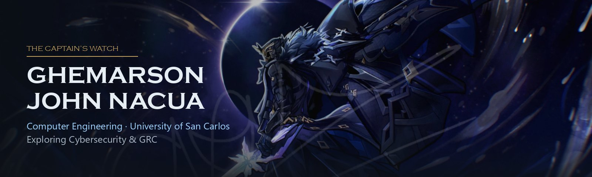
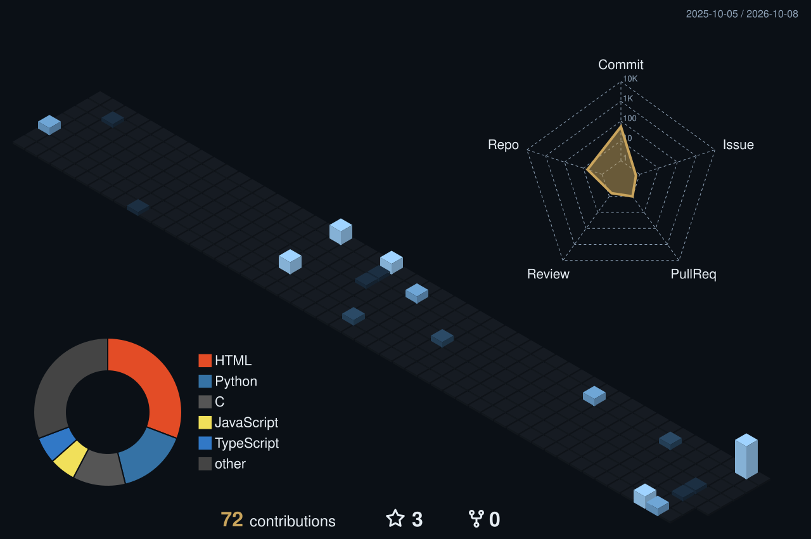

<h1 align="center">Ghemarson John Nacua</h1>

<b>Computer Engineering · University of San Carlos</b>

  

  
  
  
  

## 💫 About Me

- 🎓 4th-year **BS Computer Engineering** student at the **University of San Carlos**, Cebu
- 🛡️ Exploring **cybersecurity** and **GRC** (governance, risk & compliance), still trying different areas before settling on a niche
- 🔭 So far I've tried network security, SDN, intrusion detection, cryptography and protocol verification, and I'm curious about cloud security next
- 🤝 Member of the **USC Computer Engineering Council (CpEC)**
- 🎮 Fun fact: I play **osu!** (and Genshin)

<h3 align="center">"Whatever you do, do from the heart, as for the Lord and not for others." — Colossians 3:23 (NABRE)</h3>

## 🛡️ Security Journey

My Information Engineering courses build on each other, one step at a time:

| Step | Course | Highlights |
|:---:|---|---|
| **1** | Information Engineering 1 · CPE 3151 | Multi-threaded Python server–client chat secured with **RSA** encryption and **digital signatures**; crib-drag attack on a reused-key cipher |
| **2** | Information Engineering 2 · CPE 3252 | Turned a **Raspberry Pi** into an **Open vSwitch** switch, used **Postman** with the **Floodlight** REST API to watch traffic and block a ping flood with an ACL; man-in-the-middle exercise |
| **3** | Information Engineering 3 · CPE 3353 *(final)* | **AI security automation**: a linear **SVM** spots DoS floods in real time and has Floodlight block the attacker automatically · **Formal verification** of a three-party authentication protocol in **Scyther** that uncovered an authentication flaw |

➡️ Full write-ups on my [portfolio](https://aucs0n.github.io/#quests).

<b>🔧 Other Builds</b> (click to expand)

 

| Project | What it is |
|---|---|
| [PROJECT-PAIN](https://github.com/aucs0n/PROJECT-PAIN) / [PROJECT-MAHORAGA](https://github.com/aucs0n/PROJECT-MAHORAGA) | Data Structures & Algorithms finals and midterms |
| [COMORG](https://github.com/aucs0n/COMORG) | ALU for Computer Organization |
| [HDL](https://github.com/aucs0n/HDL) | Hardware description language labs (CPE 3101L) |
| [CpE2303L](https://github.com/aucs0n/CpE2303L) | PCB design in KiCad |
| Line-Following Robot | PIC16F877A + QTR-8D sensors with PD control, written in C |

## 💻 Tech Stack

**Languages** 
    

**Security & Networking** 
     

**Hardware** 
   

## 📊 GitHub Stats

  
  

  

  

## 🎬 Featured YouTube Video

<!-- YouTube video cards from https://github.com/DenverCoder1/github-readme-youtube-cards -->
<!-- BEGIN YOUTUBE-CARDS -->

<!-- END YOUTUBE-CARDS -->

P.S. If you want to make a GitHub profile README like this, check out this [tutorial](https://youtu.be/DWFs6aqknqw?si=oX-In0gOUUZiqINh)! 😊 The YouTube video cards are made with [github-readme-youtube-cards](https://github.com/DenverCoder1/github-readme-youtube-cards).

### ✍️ Random Dev Quote

## 📫 Connect With Me

  
  
  

Header art: Il Capitano (Genshin Impact) fan art, artist's signature kept on the image.

